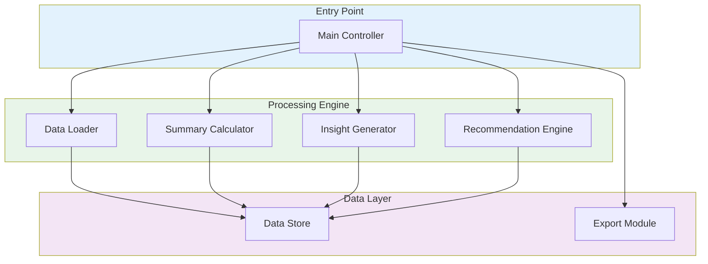

# Cloud Infrastructure Manager


[English](#english) | [Portugues (BR)](#portugues-br)

---

## English

### Overview

Cloud Infrastructure Manager built with TypeScript for provisioning, monitoring, and analyzing cloud resources. The system provides batch data processing, statistical analysis, insight generation, and recommendation engines for infrastructure optimization across multi-cloud environments.

### Architecture



### Key Features

- **Batch Data Processing** -- Configurable batch sizes for large-scale infrastructure data ingestion
- **Statistical Analysis** -- Real-time summary statistics including averages and record counts
- **Insight Generation** -- Automated category analysis and anomaly detection across resources
- **Recommendation Engine** -- Data freshness validation and actionable optimization suggestions
- **Data Export** -- Structured export with metadata for integration with dashboards and reports
- **Configurable Timeouts** -- Retry logic and timeout management for reliable cloud operations
- **Multi-Category Support** -- Resource classification and priority-based processing

### Industry Application

This infrastructure manager addresses cloud resource optimization challenges in DevOps teams, platform engineering departments, and enterprise IT operations. The analytical capabilities enable capacity planning, cost optimization, and proactive infrastructure health monitoring for AWS, GCP, and Azure environments.

### Tech Stack

| Technology | Purpose |
|------------|---------|
| **TypeScript 5.0+** | Type-safe infrastructure logic |
| **Node.js 20+** | Runtime environment |
| **Jest** | Testing framework |
| **Docker** | Containerized deployment |

### Quick Start

```bash
git clone https://github.com/galafis/Cloud-Infrastructure-Manager-TS.git
cd Cloud-Infrastructure-Manager-TS
npm install
cp .env.example .env
npm run dev
```

### Docker

```bash
docker build -t cloud-infra-manager .
docker run -p 3000:3000 --env-file .env cloud-infra-manager
```

### Project Structure

```
Cloud-Infrastructure-Manager-TS/
├── main.ts
├── tests/
│   └── cloud-infrastructure.test.ts
├── Dockerfile
├── jest.config.ts
├── package.json
├── tsconfig.json
└── LICENSE
```

### Testing

```bash
npm test
```

### License

This project is licensed under the MIT License - see the [LICENSE](LICENSE) file for details.

### Author

**Gabriel Demetrios Lafis**
- GitHub: [@galafis](https://github.com/galafis)
- LinkedIn: [Gabriel Demetrios Lafis](https://linkedin.com/in/gabriel-demetrios-lafis)

---

## Portugues (BR)

### Visao Geral

Gerenciador de Infraestrutura Cloud construido com TypeScript para provisionamento, monitoramento e analise de recursos em nuvem. O sistema fornece processamento de dados em lote, analise estatistica, geracao de insights e motores de recomendacao para otimizacao de infraestrutura em ambientes multi-cloud.

### Principais Funcionalidades

- **Processamento de Dados em Lote** -- Tamanhos de lote configuraveis para ingestao de dados de infraestrutura em larga escala
- **Analise Estatistica** -- Estatisticas resumidas em tempo real incluindo medias e contagens
- **Geracao de Insights** -- Analise automatica de categorias e deteccao de anomalias
- **Motor de Recomendacoes** -- Validacao de atualidade dos dados e sugestoes de otimizacao
- **Exportacao de Dados** -- Exportacao estruturada com metadados para integracao com dashboards

### Inicio Rapido

```bash
git clone https://github.com/galafis/Cloud-Infrastructure-Manager-TS.git
cd Cloud-Infrastructure-Manager-TS
npm install
cp .env.example .env
npm run dev
```

### Testes

```bash
npm test
```

### Licenca

Este projeto esta licenciado sob a Licenca MIT - veja o arquivo [LICENSE](LICENSE) para detalhes.

### Autor

**Gabriel Demetrios Lafis**
- GitHub: [@galafis](https://github.com/galafis)
- LinkedIn: [Gabriel Demetrios Lafis](https://linkedin.com/in/gabriel-demetrios-lafis)
