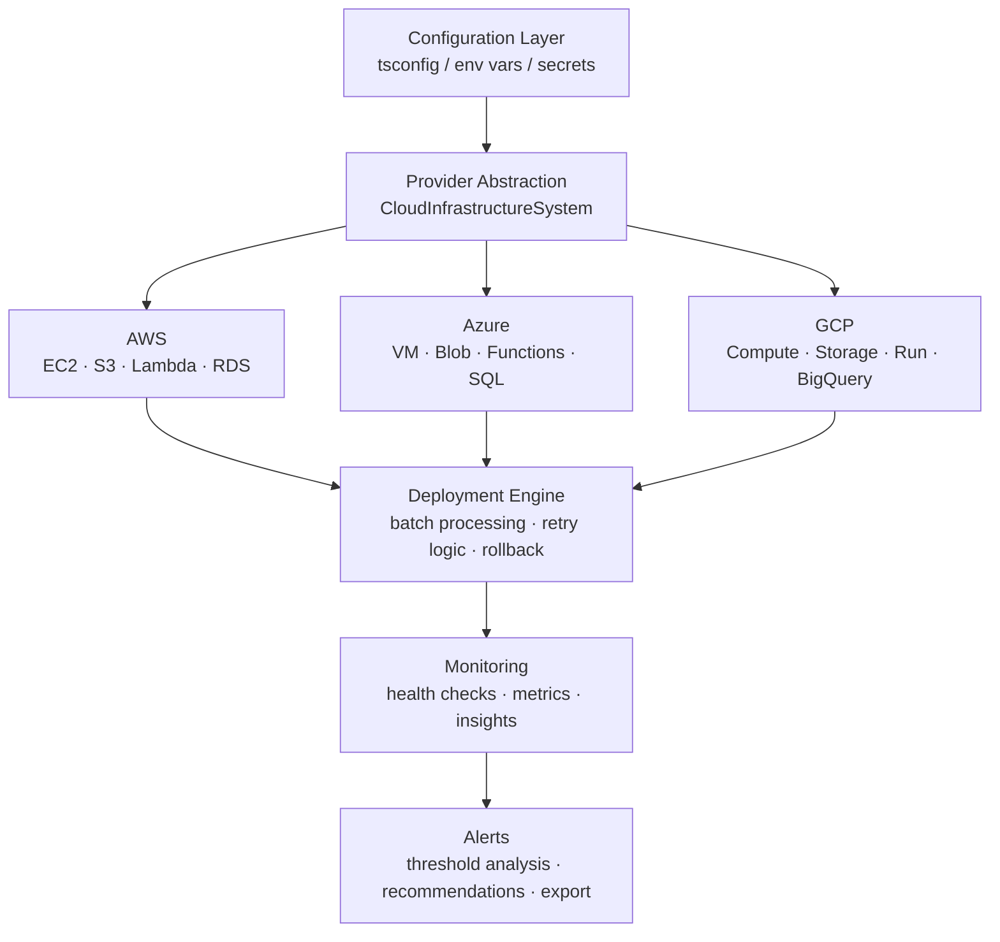
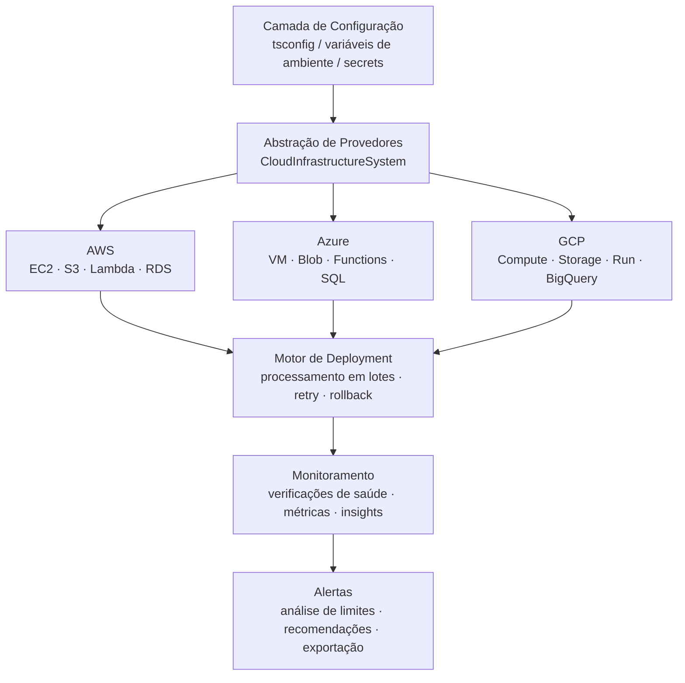

# Cloud-Infrastructure-Manager-TS

<div align="center">


</div>


## English

### Hero Image


### Overview

Cloud infrastructure management platform with automated deployment and monitoring, built with TypeScript for type safety and maintainability.

This project provides an enterprise-grade system for managing cloud resources across multiple providers (AWS, Azure, GCP), automating deployment pipelines, tracking infrastructure health in real time, and dispatching alerts when thresholds are breached.

### Architecture

The diagram below illustrates how the system flows from configuration through provider abstraction, deployment, monitoring, and alerting.



### Technology Stack

| Layer | Technologies |
|---|---|
| Language | TypeScript 5.x |
| Runtime | Node.js 20 LTS |
| Cloud | AWS · Azure · GCP |
| Build | tsc · npm scripts |
| Patterns | Async/Await · Interfaces · Generics |

### Features

- Provider-agnostic abstraction layer for AWS, Azure and GCP
- Configurable batch processing with timeout and retry logic
- Real-time infrastructure health monitoring and metrics collection
- Insight generation with statistical analysis over resource data
- Actionable recommendations based on usage patterns
- Type-safe data models via TypeScript interfaces
- Clean export interface for downstream pipeline integration
- Comprehensive error handling with structured logging

### Quick Start

```bash
# Clone the repository
git clone https://github.com/galafis/Cloud-Infrastructure-Manager-TS.git

# Navigate to project directory
cd Cloud-Infrastructure-Manager-TS

# Install dependencies
npm install

# Build the project
npm run build

# Run the application
npm start
```

### Installation & Setup

```bash
# Install dependencies
npm install

# Build the project
npm run build

# Run the application
npm start
```

To customise system behaviour, override the default configuration at initialisation:

```typescript
import { CloudInfrastructureSystem } from './src';

const manager = new CloudInfrastructureSystem();

await manager.initialize({
    batchSize: 500,      // records per processing batch
    timeout: 60000,      // request timeout in milliseconds
    retryAttempts: 5     // number of retry attempts on failure
});

const results = await manager.processData();
console.log(results);
```

### Use Cases

- Multi-cloud infrastructure lifecycle management
- Automated deployment pipeline orchestration
- Infrastructure cost and usage analysis
- Threshold-based alerting and incident recommendations
- Enterprise DevOps workflow integration

### Project Structure

```
Cloud-Infrastructure-Manager-TS/
├── README.md
├── LICENSE
├── main.ts
├── package.json
├── tsconfig.json
├── dist/
└── src/
```

### Contributing

Contributions are welcome! Please feel free to submit a Pull Request.

### License

This project is licensed under the MIT License - see the LICENSE file for details.

### Author

**Gabriel Demetrios Lafis**
- Data Scientist & Engineer
- Systems Developer & Analyst
- Cybersecurity Specialist

---

## Português

### Imagem Hero


### Visão Geral

Plataforma de gerenciamento de infraestrutura em nuvem com deployment automatizado e monitoramento em tempo real, desenvolvida em TypeScript para garantir segurança de tipos e facilidade de manutenção.

Este projeto fornece um sistema de nível empresarial para gerenciar recursos em múltiplos provedores de nuvem (AWS, Azure, GCP), automatizar pipelines de deployment, acompanhar a saúde da infraestrutura em tempo real e disparar alertas quando limites configurados são ultrapassados.

### Arquitetura

O diagrama abaixo ilustra o fluxo do sistema desde a configuração, passando pela abstração de provedores, deployment, monitoramento e alertas.



### Stack Tecnológica

| Camada | Tecnologias |
|---|---|
| Linguagem | TypeScript 5.x |
| Runtime | Node.js 20 LTS |
| Nuvem | AWS · Azure · GCP |
| Build | tsc · npm scripts |
| Padrões | Async/Await · Interfaces · Generics |

### Funcionalidades

- Camada de abstração agnóstica para AWS, Azure e GCP
- Processamento em lotes configurável com timeout e lógica de retry
- Monitoramento em tempo real da saúde da infraestrutura e coleta de métricas
- Geração de insights com análise estatística sobre dados de recursos
- Recomendações acionáveis baseadas em padrões de uso
- Modelos de dados com tipagem forte via interfaces TypeScript
- Interface de exportação limpa para integração com pipelines downstream
- Tratamento abrangente de erros com logging estruturado

### Início Rápido

```bash
# Clone o repositório
git clone https://github.com/galafis/Cloud-Infrastructure-Manager-TS.git

# Navegue para o diretório do projeto
cd Cloud-Infrastructure-Manager-TS

# Instale as dependências
npm install

# Construa o projeto
npm run build

# Execute a aplicação
npm start
```

### Instalação e Configuração

```bash
# Instale as dependências
npm install

# Construa o projeto
npm run build

# Execute a aplicação
npm start
```

Para personalizar o comportamento do sistema, sobrescreva a configuração padrão na inicialização:

```typescript
import { CloudInfrastructureSystem } from './src';

const manager = new CloudInfrastructureSystem();

await manager.initialize({
    batchSize: 500,      // registros por lote de processamento
    timeout: 60000,      // timeout em milissegundos
    retryAttempts: 5     // número de tentativas em caso de falha
});

const results = await manager.processData();
console.log(results);
```

### Casos de Uso

- Gerenciamento do ciclo de vida de infraestrutura multi-cloud
- Orquestração de pipelines de deployment automatizados
- Análise de custo e uso de infraestrutura em nuvem
- Alertas baseados em limites e recomendações de incidentes
- Integração com fluxos de trabalho DevOps empresariais

### Estrutura do Projeto

```
Cloud-Infrastructure-Manager-TS/
├── README.md
├── LICENSE
├── main.ts
├── package.json
├── tsconfig.json
├── dist/
└── src/
```

### Contribuindo

Contribuições são bem-vindas! Sinta-se à vontade para enviar um Pull Request.

### Licença

Este projeto está licenciado sob a Licença MIT - veja o arquivo LICENSE para detalhes.

### Autor

**Gabriel Demetrios Lafis**
- Cientista e Engenheiro de Dados
- Desenvolvedor e Analista de Sistemas
- Especialista em Segurança Cibernética

---

Se este projeto foi útil para você, considere dar uma estrela!
